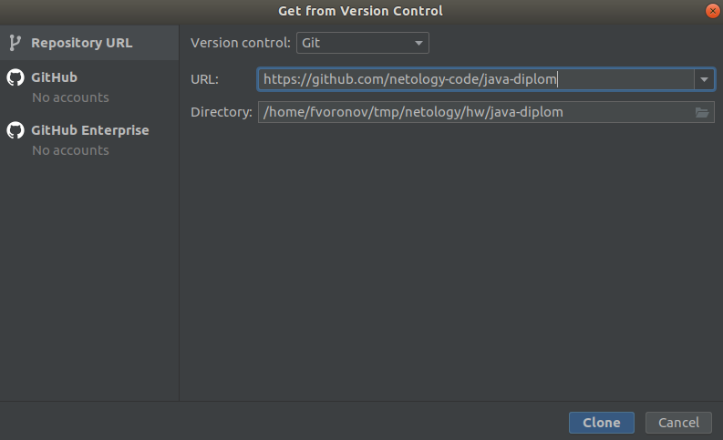

# Конвертер в текстовую графику

Вас пригласили поучаствовать в разработке приложения, умеющего скачивать картинки по URL и конвертировать изображения в текстовую графику (т. е. текст из разных символов, которые в совокупности выглядят как изображение). Вот пример его работы (картинка на нём — это текст из мелких символов):

## Скачиваем проект
Часть приложения уже написана и вашей задачей будет доработка его основной логической части в соответствии с требованиями. Поэтому для начала работы нам нужно будет скачать заготовку проекта. Для этого откройте идею, выберите в меню File -> New -> Project from Version Control. В открывшемся окне в поле URL введите `https://github.com/netology-code/java-diplom` как показано на картинке и нажмите Clone:

## Структура проекта

## Ваша роль

## Требования к конвертеру

## Тестирование

## Отладка и решение проблем

## Как сдавать?
